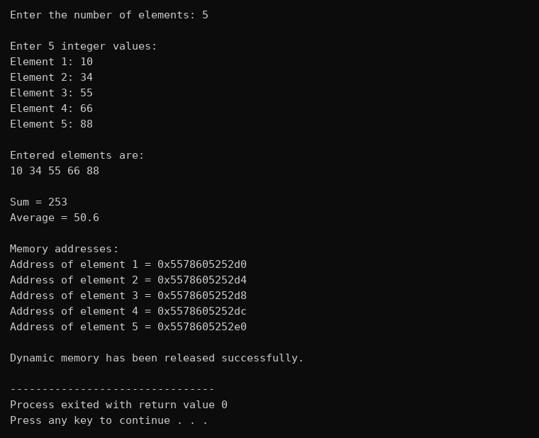
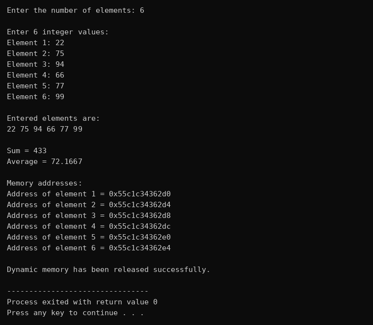
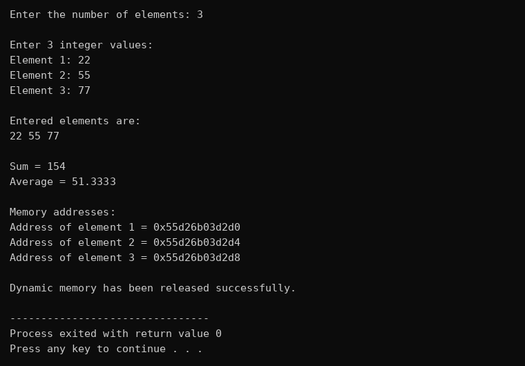

# Practical No. 04 – new and delete Operators in C++ for Dynamic Memory

**Name:** Bode Khushi Yuvraj  
**PRN:** 202501110037  
**Division / Batch:** A / A-2  
**Course:** SY B.Tech – Artificial Intelligence and Machine Learning, MIT Academy of Engineering  
**Faculty:** Khushal Kairanar

## Problem Statement
Write a C++ program to demonstrate dynamic memory allocation using the `new` and `delete` operators. The program allocates memory at runtime, accepts values from the user, displays the values along with their memory addresses, calculates the sum and average, and finally releases the allocated memory using `delete`.

## Objectives
- Understand dynamic memory allocation in C++.
- Use the `new` operator to allocate memory on the heap.
- Use the `delete` operator to release dynamically allocated memory.
- Use pointers to access dynamically allocated memory.

## Repository Structure
```
├── dynamic_memory_new_delete.cpp   # Source code
├── README.md                       # Project documentation
├── requirements.txt                # Compiler / tool requirements
├── run.bat                         # Compile & run script (Windows)
├── run.sh                          # Compile & run script (Linux / macOS)
├── .gitignore                      # Ignores compiled binaries
├── sample_input/                   # Input files for the 3 test cases
├── sample_output/                  # Program output for the 3 test cases
└── screenshots/                    # Output screenshots
```

## How to Run
**Dev-C++:** Open `dynamic_memory_new_delete.cpp` and press **F11** (Compile & Run).

**Windows (command line):** double-click `run.bat`, or run:
```
g++ -std=c++11 dynamic_memory_new_delete.cpp -o dynamic_memory.exe
dynamic_memory.exe
```

**Linux / macOS:**
```
./run.sh
```

**Run with a sample input file:**
```
dynamic_memory < sample_input/test_case_1.txt
```

## Test Cases
| Test Case | Input | Expected Output | Status |
|---|---|---|---|
| 1 | 10 34 55 66 88 | Sum = 253, Average = 50.6 | Pass |
| 2 | 22 75 94 66 77 99 | Sum = 433, Average = 72.1667 | Pass |
| 3 | 22 55 77 | Sum = 154, Average = 51.3333 | Pass |

Each input file contains the number of elements first, followed by the values.

## Screenshots




> Memory addresses change on every run, so they will differ from the screenshots.

## Dataset
Not applicable. This program takes input directly from the user and does not use any dataset.

## Conclusion
The program successfully demonstrates dynamic memory allocation in C++ using pointers with the `new` and `delete` operators. Memory is allocated during runtime according to the user's need and released after use, which prevents memory leaks.
